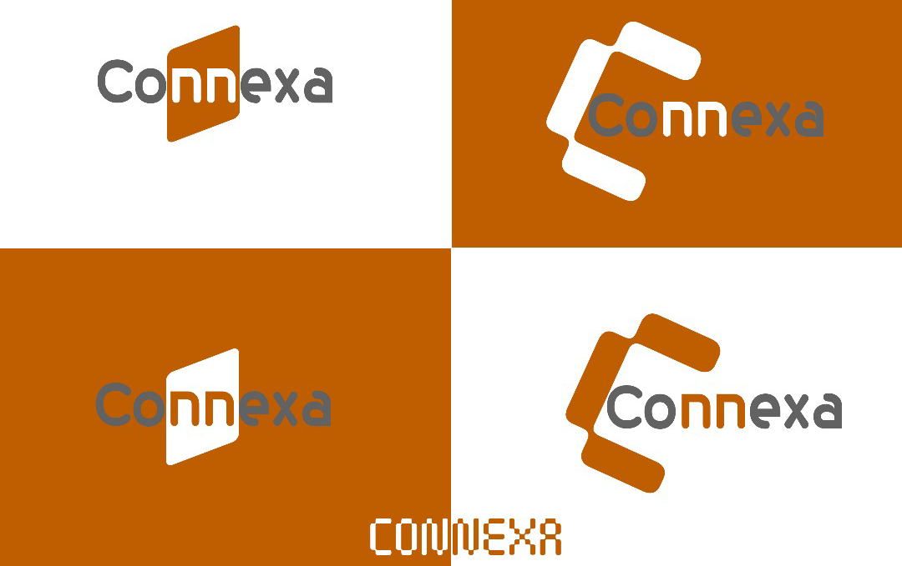

  
  
  
  # 🌟 Hello, I'm Jean Marc Goffart 🌟
  
  
🚀 I'm a passionate <strong>Network & Cloud Engineer</strong> with a strong background in <strong>Backend Development</strong> and <strong>Automation</strong>. My work focuses on building robust, secure, and automated systems that solve real-world challenges. Based in Uganda, I'm dedicated to mastering my craft and becoming a recognized full-stack, network-aware developer.

  
  ---
  
  ### ✅ Reach Me On:
  
  
  
  

---

### 🧠 Languages & Tools I Have Placed My Hands On

  
  
  
  
  
  
  
  
  

---

### 🚀 Featured Projects

  
  
  

  
🔗 Explore more of my work on <a href="https://github.com/your-username?tab=repositories" target="_blank">my GitHub repositories page</a>.

---

### ⭐ Show Your Support

  

