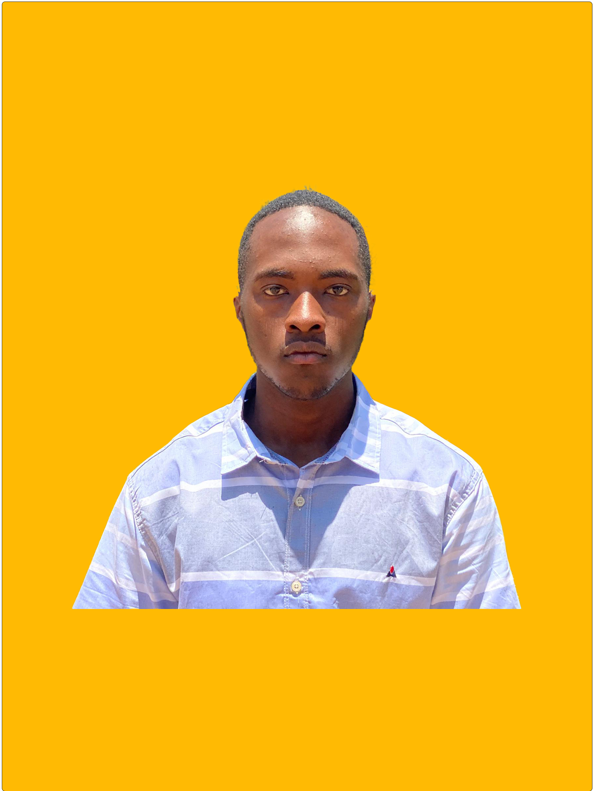

<table>
  <tr>
    <td>
      
    </td>
    <td>
      <h1>🌟 Welcome to My Repository 👋</h1>
      <h2>🔹 About Me</h2>
      
Hello! I'm <b>Jean Marc Goffart</b>, a passionate <b>Network Automation & Cybersecurity Enthusiast</b> with solid experience in <b>Networking, Web & Mobile Development</b>, and <b>Security-focused Solutions</b>.

    </td>
  </tr>
</table>

---

<table>
  <tr>
    <th colspan="2">🚀 My Expertise</th>
  </tr>
  <tr>
    <td><h3>🛡️ Networking Automation & Cybersecurity</h3></td>
    <td>
      ✅ <b>Network Device Automation:</b> Automating router/switch configurations using Python 
      ✅ <b>Traffic Management:</b> Monitoring and optimizing traffic for performance and security 
      ✅ <b>Network Security:</b> Threat detection, system hardening, and log analysis 
      ✅ <b>Secure Communication:</b> Designing secure networks for safe data transmission
    </td>
  </tr>
  <tr>
    <td><h3>📡 Web & Mobile Development</h3></td>
    <td>
      🔹 <b>Frontend:</b> Responsive interfaces using JavaScript, HTML, and CSS 
      🔹 <b>Backend:</b> API development with Python (Django/Flask), SQL-based databases 
      🔹 <b>Mobile Apps:</b> Cross-platform apps using tools like React Native 
      🔹 <b>System Integration:</b> Merging web/mobile UIs with automation/security tools
    </td>
  </tr>
  <tr>
    <td><h3>💻 System & Platform Scripting</h3></td>
    <td>
      📌 <b>Automation:</b> Writing scripts for networking, backup, and maintenance tasks 
      📌 <b>Security Tools:</b> Developing and customizing cybersecurity utilities 
      📌 <b>Database:</b> Query building, secure data storage, and log management
    </td>
  </tr>
</table>

---

<table>
  <tr>
    <th colspan="2">💡 Languages & Technologies</th>
  </tr>
  <tr>
    <td colspan="2" align="center">
      
      
      
      
      
      
    </td>
  </tr>
</table>

---

<table>
  <tr>
    <th>📍 Location</th>
    <th>🎯 Goals</th>
  </tr>
  <tr>
    <td>🌍 Based in <b>Uganda, Africa</b></td>
    <td>
      🯠Mastering <b>networking automation and security</b> 
      🯠Building <b>real-world web & mobile solutions</b> with a focus on performance and security 
      🎯 Becoming a <b>recognized full-stack network-aware developer</b>
    </td>
  </tr>
</table>

---

## 📬 Let's Connect!  
💬 **Have a project idea or collaboration in mind? Feel free to reach out!**  

  
  
  

